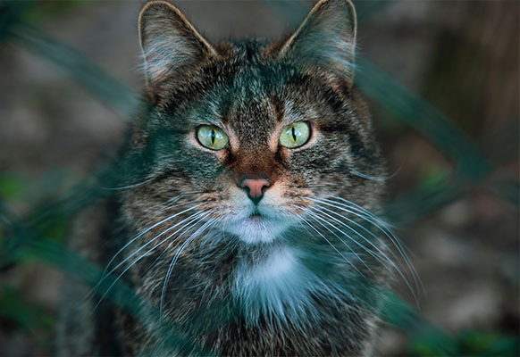

# Configurator for Creating Custom WebGL Distortion Effects


## Basics of the configurator

The configurator allows you to modify all the details of the effect, making it possible to create unique animations. Even though you don’t have to be a programmer to create your own effect, understanding the options available will give you more insight into what you can achieve with it.

To see your personalized effect in action, either click on the image or drag the Progress bar. The Duration option sets the time of the whole animation.

Under Easings you can control the “rate of change” of your animation. For example:

- Power1.easeOut: Start really fast but end slowly
- Power1.easeInOut: Start and end slowly, but go really fast in the middle of the animation
- Bounce: Bounce around like a basketball

The simplest easings to play around with are Power0-4 with ease-out. If you would like to know the difference between each easing, check out this ease visualizer.

Note that the configurator automatically saves your progress for later use. Feel free to close the page and come back to it later.


## Timing, Activation and Transformation

Timing, Activation and Transformation are concepts that come from our previous tutorial. Each on of them has their own list of types, that also have their own set of options for you to explore.

You can explore them by changing the types, and expanding the respective options tab. When you swap one type for another, your previous set of options is saved in case you want to go back to it.


### Timing

The timing function maps the activation into actual progress for each vertex. Without timing, the activation doesn’t get applied and all the vertices move at the same rate. Set timing type to none to see it in action.

- SameEnd: The vertices have different start times, but they all end at the same time. Or vice versa.
- sections: Move by sections, wait for the previous section to finish before starting.


### Activation

The activation determines how the plane is going to move to full screen:

- side: From left to right.
- corners: From top-left to bottom-right
- radial: From the position of the mouse
- And others.

For a visual representation of the current activation, toggle debug activation and start the animation to see it in action.


### Transformation

Transform the plane into a different shape or position over the course of the animation:

- Flip: Flip the plane on the X axis
- simplex: Move the vertices with noise over the while transitioning
- wavy: Make the plane wavy while transitioning
- And more

Some effects, use seed for their inner workings. You can set the initial seed and determine when this seed is going to be randomized.

Note that although these three concepts allow for a large amount of possible effects, some options won’t work quite well together.


Adding your effect to your site
Now that you made your custom effect, it is time to add it to your site. Let’s see how to do that, step by step.

First, download the code and copy some of the required files over:

- THREEjs: js/three.min.js
- TweenLite: js/TweenLite.min.js
- ImagesLoaded: js/imagesloaded.pkgd.min.js

For preloading the images
- The effect’s code: js/GridToFullscreenEffect.js
- TweenLite’s CSSPlugin: js/CSSPlugin.min.js (optional)
- TweenLite’s EasePack:js/EasePack.min.js (optional; if you use the extra easings)

Include these in your HTML file and make sure to add js/GridToFullscreenEffect.js last.

Now let’s add the HTML structure for the effect to work. We need two elements:

- div#App: Where our canvas is going to be
- div#itemsWrapper: Where our HTML images are going to be

```html
<body>
    <div id="app"></div>
    <div id="itemsWrapper"></div>    
</body>
```

Note: You can use any IDs or classes you want as long as you use them when instantiating the effect.


Inside #itemsWrapper we are going to have the HTML items for our effect.

Our HTML items inside #itemsWrapper can have almost any structure. The only requirement is that it has two image elements as the first two children of the item.

The first element is for the small-scale image and the second element is the large-scale image.

Aside from that, you can have any caption or description you may want to add at the bottom. Take a look at how we did ours in our previous post:

```html
<div id="app"></div>
<div id="itemsWrapper">
    <figure class="grid__item">
        
        
        <figcaption class="grid__item-caption">
            <h2 class="grid__item-title">Our Item Title</h2>
            <p class="grid__item-text">
                Our Item Description
            </p>
        </figcaption>
    </figure>
    ...
</div>
```

You may add as many items as you want. If you add enough items to make your container scrollable. Make sure to send your container in the options, so the effect can account for its scroll.

With our HTML items in place, let’s get the effect up and running.

We’ll instantiate GridToFullscreenEffect, add our custom options, and initialize it.

```javascript
<script>
  const transitionEffect = new GridToFullscreenEffect(
        document.getElementById("app"),
        document.getElementById("itemsWrapper"),
      {
          "duration":1.8,
          "timing":{"type":"sameEnd","props":{"latestStart":0.5,"reverse":true}},
          "activation":{"type":"snake","props":{"rows":4}},
          "transformation":{"type":"flipX"},
          "easings":{"toFullscreen":Quint.easeOut,"toGrid":Quint.easeOut}
      }
  );
  transitionEffect.init();
</script>
```

Our effect is now mounted and working. But clicking on an item makes the image disappear and we end up with a black square.

The effect doesn’t take care of loading the images. Instead, it requires you to give them to the effect whenever they load. This might seem a bit inconvenient, but it allows you to load your images the way it’s most suitable for your application.

You could preload all the images upfront, or you could only load the images that are on screen, and load the other ones when needed. It’s up to how you want to do that.

We decided to preload all the images using imagesLoaded like this:

```javascript
imagesLoaded(document.querySelectorAll("img"), instance => {
    document.body.classList.remove("loading");

    // Make Images sets for creating the textures.
    let images = [];
    for (var i = 0, imageSet = {}; i < instance.elements.length; i++) {
        let image = {
            element: instance.elements[i],
            image: instance.images[i].isLoaded ? instance.images[i].img : null
        };
        if (i % 2 === 0) {
            imageSet = {};
            imageSet.small = image;
        }

        if (i % 2 === 1) {
            imageSet.large = image;
            images.push(imageSet);
        }
    }
    configurator.effect.createTextures(images);
});
```

With that last piece of code, our effect is running and it shows the correct images. 


## Options

Options used to modify the effect and create variations:

```javascript
const options = {
  // Timing of the effect and vertice timing calculation
  duration: 1.,// Seconds of the animation
  easings: {
    toFullscreen: Power0.easeNone, // gsap EasePack easing
    toGrid: Power0.easeNone // gsap EasePack easing
  },
  timing: {
    // How to calculate the timing of a vertice
    type: "sameEnd", // "sameEnd" | "sections"
    props: {}, // Type specific props
  },
  // Plane transformations
  transformation: {
    type: "none", // "flipX" | "sin" | "simplex" etc...
    props: {} // Type specific props
  },
  // The plane activation used with timing
  activation: {
    type: "sides", // "sides" | "corners" | "radial" | etc...
    props: {} // Type specific props
  },
  // General seed for some effects
  seed: 0, // Number
  randomizeSeed: null, // "itemUnique" | "InOutUnique" | "tweenUnique"
  // Easings for the effects tweens
  debug: {
    activation: false, // Display the activation as color
  }
};
```
